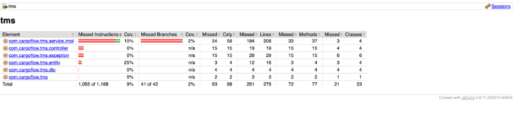
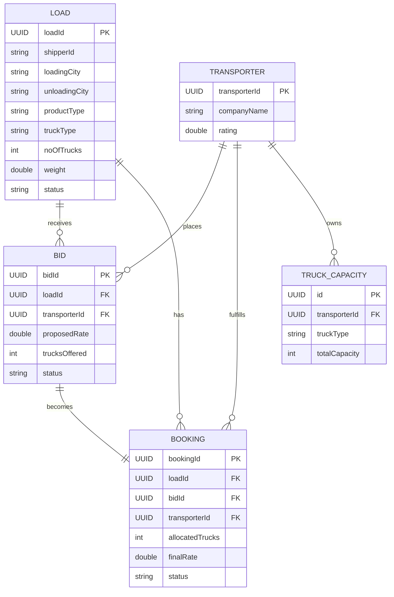

# CargoFlow - Transport Management System (TMS) Backend

## Project Overview
This is a robust backend system for a **Transport Management System (TMS)** designed to connect Shippers (who have goods) with Transporters (who have trucks). It handles complex logistics workflows including load posting, bidding, booking, and capacity management.

The system is built to handle real-world business rules such as:
- **Capacity Validation:** Ensuring transporters have enough trucks before bidding.
- **Concurrency Control:** Preventing double-booking of loads.
- **Smart Allocation:** Allowing multiple transporters to fulfill a single large load.
- **Best Bid Calculation:** Automatically ranking bids based on price and transporter rating.

## Why CargoFlow? (Business Impact)
If you are wondering *why* this backend exists, here is the real-world problem it solves:

1.  **Automation (No More Phone Calls)**
    - *Problem:* Traditionally, shippers call 10 transporters to negotiate rates.
    - *Solution:* **`POST /loads`** & **`POST /bids`**. Shippers post requirements, Transporters bid digitally. Zero manual effort.

2.  **Transparency (Fair Selection)**
    - *Problem:* Managers might favor specific transporters unfairly.
    - *Solution:* **`GET /best-bids`**. Our algorithm `(Price vs Rating)` mathematically selects the best option, ensuring fairness.

3.  **Reliability (No Double Booking)**
    - *Problem:* Two managers might book the last available truck for different clients simultaneously.
    - *Solution:* **`POST /bookings`** uses **Optimistic Locking**. The system prevents race conditions, ensuring 1 truck isn't promised to 2 people.

## Tech Stack
- **Language:** Java 17
- **Framework:** Spring Boot 3.2
- **Database:** PostgreSQL
- **ORM:** Spring Data JPA
- **Documentation:** Swagger / OpenAPI
- **Build Tool:** Maven

## Key Features
1.  **Load Management**: Shippers can post loads with details like origin, destination, weight, and truck type.
2.  **Bidding System**: Transporters can view open loads and submit bids.
    - *Constraint:* Transporters cannot bid more trucks than they own.
3.  **Booking Engine**:
    - **Optimistic Locking:** Prevents race conditions when multiple transporters try to book the same load.
    - **Multi-Truck Allocation:** A load requiring 10 trucks can be split between Transporter A (5 trucks) and Transporter B (5 trucks).
4.  **Automated Rating**: Bids are scored using a weighted formula: `(1 / Rate) * 0.7 + (Rating / 5) * 0.3`.

## Setup & Running Locally

### Prerequisites
- **Java 17** (Crucial: This project requires Java 17. Java 25 is not supported yet).
- **PostgreSQL** (Running on localhost:5432).

### Steps
1.  **Clone the repository**:
    ```bash
    git clone https://github.com/btwitsPratyush/CargoFlow.git
    cd CargoFlow/backend
    ```

2.  **Configure Database**:
    Update `src/main/resources/application.yml` if your Postgres credentials differ:
    ```yaml
    spring:
      datasource:
        username: postgres
        password: yourpassword
    ```

3.  **Run the Application**:
    ```bash
    # Ensure you are using Java 17
    export JAVA_HOME="/path/to/java17"
    mvn spring-boot:run
    ```

4.  **Access API Documentation**:
    Once running, open your browser and go to:
    👉 **[Swagger UI](http://localhost:8080/swagger-ui/index.html)**
    
    You can also import the OpenAPI specification into Postman:
    👉 [OpenAPI JSON](http://localhost:8080/v3/api-docs)

## Verification Scripts
We have included shell scripts to verify core logic:
- `./verify_capacity.sh`: Tests that transporters cannot bid beyond their capacity.
- `./verify_multi_allocation.sh`: Tests splitting a load between multiple transporters.
- `./verify_best_bids.sh`: Tests the algorithm that ranks the best bids.

## 📊 Test Coverage

*Note: Run `mvn test` to generate the coverage report.*

## 📂 Project Structure
```
src/main/java/com/cargoflow/tms
├── controller/      # REST API Endpoints
├── service/         # Business Logic (Rules & Calculations)
├── repository/      # Database Access Layer
├── entity/          # Database Tables (Load, Bid, Booking)
├── dto/             # Data Transfer Objects
└── exception/       # Global Error Handling
```

## 🗄️ Database Schema


## 📝 API Endpoints
| Method | Endpoint | Description |
|--------|----------|-------------|
| POST | `/api/v1/loads` | Create a new load |
| GET | `/api/v1/loads` | List loads (filter by status) |
| POST | `/api/v1/transporters` | Register a transporter |
| PUT | `/api/v1/transporters/{id}/trucks` | Update truck capacity |
| POST | `/api/v1/bids` | Submit a bid |
| POST | `/api/v1/bookings` | Accept a bid & create booking |

## Conclusion (Samajhne ke liye)
In short, **CargoFlow** Shippers aur Transporters ke beech ka ek smart bridge hai.
- **Shippers** ko 10 jagah call nahi karna padega, bas load post karo.
- **Transporters** ko fair chance milega apni rating aur price ke basis par.
- **System** khud dhyan rakhega ki koi cheating (double booking) na ho.

**Simple words mein:** Yeh Logistics industry ka ek automated manager hai jo sab kuch smooth aur fair rakhta hai!

## 👨‍💻 Author
**Pratyush**
